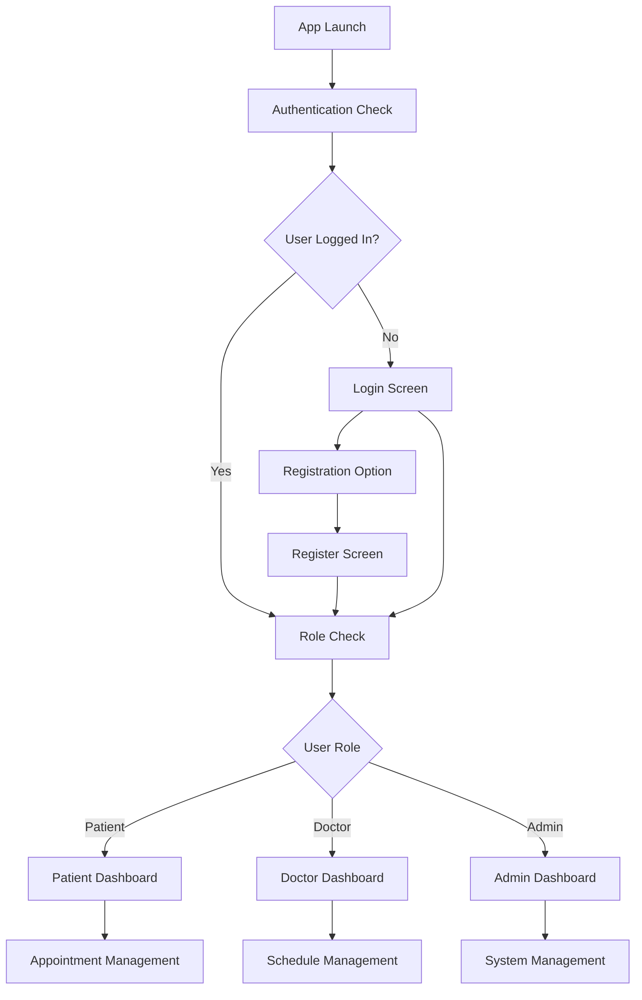

# 🏥 Healthcare Appointment Management System

<div align="center">

[](https://flutter.dev)
[](https://dart.dev)
[](https://sqlite.org)
[](https://opensource.org/licenses/MIT)

**A comprehensive Flutter-based mobile application for managing healthcare appointments with role-based access control, GPS verification, automated notifications, and advanced analytics.**

</div>

## 🎬 Demo Video

[](https://www.youtube.com/shorts/o5WMVguocw4)

**Watch the full demo:** [Healthcare Appointment Management System Demo](https://www.youtube.com/shorts/o5WMVguocw4)

---

## 📋 Table of Contents

- [🎬 Demo Video](#-demo-video)
- [🌟 Key Features](#-key-features)
- [🩺 Enhanced Patient Experience](#-enhanced-patient-experience)
- [👨‍⚕️ Doctor Dashboard Features](#-doctor-dashboard-features)
- [🔐 Admin Control Panel](#-admin-control-panel)
- [🏥 Advanced System Features](#-advanced-system-features)
- [🚀 Getting Started](#-getting-started)
- [👩‍💻 Technical Architecture](#-technical-architecture)
- [🗄️ Database Schema](#-database-schema)
- [🔒 Security Features](#-security-features)
- [📱 Mobile App Features](#-mobile-app-features)
- [📊 Analytics & Reporting](#-analytics--reporting)
- [🧪 Testing](#-testing)
- [🛠️ Development](#-development)
- [🤝 Contributing](#-contributing)
- [📄 License](#-license)

---

## 🌟 Key Features

### 🩺 Enhanced Patient Experience

#### Seamless Registration & Authentication
- **Quick Account Creation**: Streamlined registration process with role selection (Patient, Doctor, Admin)
- **Secure Authentication**: Password hashing with crypto library and JWT-based session management
- **Multi-role Support**: Automatic dashboard routing based on user role
- **Profile Management**: Complete patient profile with medical history and preferences

#### Smart Doctor Search & Discovery
- **Advanced Search Filters**: Find doctors by name, specialization, hospital, rating, and consultation fee
- **Location-based Search**: Search doctors by city and proximity to your location
- **Real-time Availability**: Instant availability check with live slot updates
- **Doctor Profiles**: Comprehensive profiles with experience, qualifications, ratings, and patient reviews
- **Specialization Categories**: Browse doctors by 12+ medical specializations
- **Hospital Information**: Complete hospital details with contact information and facilities

#### Intelligent Appointment Booking
- **Real-time Slot Booking**: Live availability checking to prevent double bookings
- **Smart Time Slots**: Pre-defined time slots with automatic conflict resolution
- **Date Restrictions**: No Sunday bookings with 30-day advance booking window
- **Detailed Booking Form**: Comprehensive reason for visit (minimum 10 characters) and optional notes
- **Instant Confirmation**: Immediate booking confirmation with unique appointment tokens
- **Multi-step Validation**: Form validation and availability verification before booking

#### GPS Location Verification System
- **Automated Location Check**: GPS-based verification on appointment day
- **500-meter Radius**: Automatic verification within 500 meters of hospital
- **Real-time Monitoring**: Continuous location tracking during appointment time
- **Auto-cancellation**: Automatic appointment cancellation if patient is too far away
- **Visual Feedback**: Interactive location verification interface with distance display
- **Permission Handling**: Seamless location permission requests and settings management
- **Accuracy Tracking**: Location accuracy monitoring and error handling

#### Comprehensive Appointment Management
- **Multi-status Tracking**: Track appointments through pending, approved, rejected, completed, and cancelled states
- **Real-time Updates**: Live status updates across all interfaces
- **Appointment History**: Complete history with advanced filtering options
- **Search & Filter**: Search by doctor name, specialization, hospital, or appointment details
- **Categorized Views**: Separate views for upcoming, past, and all appointments
- **One-click Actions**: Easy appointment cancellation and rescheduling
- **Detailed Information**: Complete appointment details with doctor and hospital information

#### Advanced Email Notification System
- **SendGrid Integration**: Professional email delivery with high deliverability
- **Appointment Confirmations**: Instant email confirmation with appointment token
- **Status Updates**: Real-time email notifications for all status changes
- **Automated Reminders**: Smart reminder system with 1-hour and 15-minute alerts
- **Location Alerts**: Email notifications for location verification requirements
- **Cancellation Notices**: Automatic notifications for appointment cancellations
- **Professional Templates**: HTML-formatted emails with hospital branding
- **Multiple Languages**: Support for multiple language email templates

#### Token-based Reference System
- **Unique Tokens**: Cryptographically secure appointment tokens (APT-timestamp format)
- **Easy Reference**: Simple token-based appointment lookup and management
- **QR Code Generation**: QR codes for quick hospital check-in (coming soon)
- **Token Validation**: Secure token verification at hospital reception
- **Copy-to-clipboard**: Easy token copying for sharing and reference
- **Token History**: Complete token usage history and tracking

### 👨‍⚕️ Doctor Dashboard Features

#### Professional Profile Management
- **Complete Medical Profiles**: License number, specialization, experience, and qualifications
- **Hospital Affiliation**: Multi-hospital association with primary hospital selection
- **Availability Management**: Custom available days and hours configuration
- **Consultation Fees**: Transparent fee structure with currency support
- **Professional Bio**: Detailed doctor biography and areas of expertise
- **Verification Status**: Medical license verification and hospital credentialing

#### Advanced Appointment Review System
- **Request Queue**: Organized queue of pending appointment requests
- **Patient Information**: Access to patient history and medical records
- **Decision Tools**: Approve, reject, or request additional information
- **Custom Notes**: Add professional notes to appointment decisions
- **Bulk Actions**: Handle multiple appointments simultaneously
- **Priority Sorting**: Sort appointments by urgency, date, or patient type

#### Schedule Overview & Management
- **Visual Calendar**: Interactive calendar view with appointment slots
- **Dashboard Analytics**: Quick stats for pending, approved, and completed appointments
- **Patient Communication**: Direct messaging through the platform (coming soon)
- **Appointment History**: Complete record of all patient interactions
- **Revenue Tracking**: Consultation fee tracking and payment status
- **Time Blocking**: Block specific time slots for breaks or emergencies

#### Real-time Notifications & Alerts
- **Instant Alerts**: Push notifications for new appointment requests
- **Email Integration**: Professional email notifications with appointment details
- **SMS Alerts**: Optional SMS notifications for urgent appointments (coming soon)
- **Custom Preferences**: Personalized notification settings and schedules
- **Sound Alerts**: Audio notifications for mobile app users
- **Badge Counters**: Visual indication of pending requests and actions

### 🔐 Admin Control Panel

#### Comprehensive System Dashboard
- **Real-time Metrics**: Live statistics for users, appointments, and system performance
- **Growth Analytics**: User registration trends and platform adoption metrics
- **System Health**: Database performance, API response times, and error monitoring
- **Revenue Analytics**: Financial metrics and consultation fee analysis
- **Geographic Distribution**: User and appointment distribution by location
- **Performance KPIs**: Key performance indicators with trend analysis

#### Advanced User Management
- **Multi-role Administration**: Manage patients, doctors, and admin accounts
- **Account Activation**: User account approval and deactivation controls
- **Bulk Operations**: Mass user operations and data management
- **User Search**: Advanced search and filtering by multiple criteria
- **Profile Verification**: Doctor license and hospital credential verification
- **Activity Monitoring**: User activity logs and session management

#### Business Intelligence & Analytics
- **Registration Trends**: Detailed analysis of user growth patterns
- **Appointment Analytics**: Success rates, cancellation patterns, and peak hours
- **Doctor Performance**: Top-performing doctors and patient satisfaction metrics
- **Hospital Utilization**: Resource utilization across hospital network
- **Revenue Reports**: Financial analytics with trend forecasting
- **Data Export**: CSV and JSON export capabilities for external analysis

#### System Administration Tools
- **Database Management**: Direct database access for advanced operations
- **Email Service Management**: SendGrid integration monitoring and configuration
- **Location Service Control**: GPS service monitoring and configuration
- **Background Services**: Control of automated reminder and monitoring services
- **Security Management**: Access control, authentication logs, and security monitoring
- **System Maintenance**: Automated backups, database optimization, and cleanup

### 🏥 Advanced System Features

#### Intelligent Background Processing
- **Automated Reminders**: Node-cron powered reminder system with 1-hour and 15-minute alerts
- **Smart Monitoring**: Automatic appointment status monitoring and updates
- **Location Tracking**: Continuous GPS verification during appointment times
- **Auto-cancellation**: Intelligent cancellation for location verification failures
- **Database Optimization**: Automated database cleanup and optimization
- **Error Recovery**: Automatic error detection and recovery mechanisms

#### Professional Email Integration
- **SendGrid API**: Professional email delivery with 99%+ deliverability
- **Template Management**: Customizable HTML email templates
- **Delivery Tracking**: Email delivery confirmation and bounce handling
- **Automated Workflows**: Trigger-based email sequences for different appointment stages
- **Multi-language Support**: Localized email templates for different regions
- **Attachment Support**: Medical reports and prescription attachments (coming soon)

#### Security & Compliance Features
- **Data Encryption**: End-to-end encryption for sensitive medical data
- **HIPAA Compliance**: Healthcare data protection and privacy compliance
- **Access Control**: Role-based permissions with granular control
- **Audit Trails**: Complete activity logging for compliance reporting
- **Secure Authentication**: Multi-factor authentication support (coming soon)
- **Data Backup**: Automated daily backups with encryption

#### Mobile-First Design
- **Responsive UI**: Optimized for all screen sizes and orientations
- **Native Performance**: Flutter-based native mobile performance
- **Offline Support**: Limited offline functionality for appointment viewing
- **Push Notifications**: Native mobile push notifications
- **Dark Mode**: Automatic dark/light theme switching (coming soon)
- **Accessibility**: Full accessibility support for users with disabilities

## 🚀 Enhanced Patient Journey

### Registration & Onboarding
1. **Account Creation**: Visit registration screen and select "Patient" role
2. **Profile Setup**: Complete personal information with phone number validation
3. **Email Verification**: Receive welcome email with account confirmation
4. **Dashboard Access**: Automatic login and dashboard redirection
5. **Feature Tour**: Interactive onboarding tour of key features

### Doctor Discovery & Selection
1. **Smart Search**: Use advanced search filters to find the perfect doctor
2. **Compare Options**: Compare multiple doctors by ratings, fees, and experience
3. **Read Reviews**: Patient reviews and ratings for informed decisions
4. **Check Availability**: Real-time availability for immediate booking
5. **Hospital Information**: Complete hospital details and location

### Appointment Booking Process
1. **Select Doctor**: Choose from filtered search results
2. **Pick Date**: Select from available dates (excluding Sundays)
3. **Choose Time**: Pick from available time slots with real-time updates
4. **Provide Details**: Enter reason for visit and optional notes
5. **Confirm Booking**: Review and confirm appointment with instant token generation
6. **Email Confirmation**: Receive detailed confirmation email with all information

### Appointment Day Experience
1. **Reminder Notifications**: Receive 1-hour and 15-minute email reminders
2. **Location Verification**: Use GPS verification when arriving at hospital
3. **Real-time Updates**: Get live updates on appointment status
4. **Hospital Check-in**: Present appointment token at reception
5. **Post-appointment**: Receive completion confirmation and feedback request

### Ongoing Management
1. **Track Appointments**: Monitor all appointments in organized dashboard
2. **Receive Updates**: Get real-time notifications for status changes
3. **History Access**: Complete appointment history with search and filter
4. **Easy Cancellation**: One-click cancellation with automatic notifications
5. **Profile Management**: Update personal information and preferences

## 👩‍💻 Technical Architecture

### 🏗️ Project Structure

```
login_app/
├── lib/
│   ├── main.dart                          # App entry point and routing
│   ├── models/                            # Data models
│   │   ├── user_model.dart               # User data structure
│   │   ├── appointment_model.dart        # Appointment data structure
│   │   ├── doctor_model.dart             # Doctor profile structure
│   │   ├── hospital_model.dart           # Hospital information structure
│   │   └── notification_model.dart       # Notification data structure
│   ├── screens/                          # UI screens
│   │   ├── login_screen.dart             # Authentication interface
│   │   ├── register_screen.dart          # User registration interface
│   │   ├── welcome_screen.dart           # Welcome dashboard
│   │   ├── admin_screen.dart             # Admin panel interface
│   │   ├── admin_dashboard.dart          # Admin analytics dashboard
│   │   ├── doctor_dashboard.dart         # Doctor management interface
│   │   ├── patient_dashboard.dart        # Patient appointment interface
│   │   └── patient_screens/              # Patient-specific screens
│   │       ├── book_appointment_screen.dart
│   │       ├── my_appointments_screen.dart
│   │       ├── appointment_confirmation_screen.dart
│   │       └── appointment_verification_screen.dart
│   ├── services/                         # Business logic services
│   │   ├── background_service.dart       # Background task management
│   │   ├── email_service.dart            # SendGrid email integration
│   │   └── location_service.dart         # GPS and location services
│   ├── database_helper.dart              # SQLite database operations
│   └── demo_data.dart                    # Sample data generation
├── android/                              # Android platform files
├── ios/                                  # iOS platform files
├── web/                                  # Web platform files
├── windows/                              # Windows platform files
├── linux/                                # Linux platform files
├── macos/                                # macOS platform files
└── test/                                 # Unit and widget tests
```

### 🔧 Technology Stack

#### Frontend
- **Framework**: Flutter 3.7.2+
- **Language**: Dart
- **State Management**: StatefulWidget (considering Bloc/Provider)
- **Database**: SQLite with sqflite package
- **Location**: Geolocator package
- **Email**: Integration with SendGrid API
- **Permissions**: permission_handler package

#### Core Dependencies
```yaml
dependencies:
  flutter:
    sdk: flutter
  cupertino_icons: ^1.0.8
  sqflite: ^2.3.0              # Local SQLite database
  path: ^1.8.3                 # Path manipulation
  crypto: ^3.0.3               # Password hashing
  geolocator: ^10.1.1          # GPS location services
  permission_handler: ^11.4.0  # Device permissions
  http: ^1.0.0                 # HTTP requests for email service
```

### 📊 Application Flow



## 🔒 Security Features

### Authentication & Authorization
- JWT-based authentication
- Role-based access control
- Session management
- Two-factor authentication

### Data Protection
- Password hashing with bcrypt
- Data encryption at rest
- HTTPS/SSL encryption
- GDPR compliance

### API Security
- Rate limiting
- Input validation
- SQL injection prevention
- XSS protection

## 🚀 Quick Start

### ⚡ Try the App Instantly

```bash
# Clone the repository
git clone https://github.com/your-username/healthcare-appointment-system.git
cd healthcare-appointment-system/login_app

# Install dependencies
flutter pub get

# Run the app
flutter run
```

### 🔑 Test Credentials
- **Email:** `test@example.com`
- **Password:** `password123`

---

## 🚀 Getting Started

### Prerequisites
- Flutter SDK (3.7.2 or higher)
- Android Studio/VS Code with Flutter extensions
- Android Emulator or iOS Simulator
- Git

### 📥 Installation Steps

#### 1. Clone Repository
```bash
git clone https://github.com/your-username/healthcare-appointment-system.git
cd healthcare-appointment-system/login_app
```

#### 2. Install Dependencies
```bash
flutter pub get
```

#### 3. Check Flutter Setup
```bash
flutter doctor
```

#### 4. Run the Application
```bash
# List available devices
flutter devices

# Run on Android emulator
flutter run -d emulator-5554

# Run on iOS simulator  
flutter run -d ios

# Run on Chrome (web)
flutter run -d chrome
```

#### 5. Build for Production
```bash
# Android APK
flutter build apk --release

# iOS IPA
flutter build ios --release

# Web
flutter build web --release
```

### 🔧 Configuration (Optional)

For full functionality, configure these services:

#### Email Service (SendGrid)
```dart
// lib/services/email_service.dart
const String SENDGRID_API_KEY = 'your_sendgrid_api_key';
```

#### Google Maps API
```dart
// android/app/src/main/AndroidManifest.xml
<meta-data android:name="com.google.android.geo.API_KEY" 
           android:value="your_google_maps_api_key"/>
```

---

## 🎯 Usage Guide

### For Patients
1. **Register**: Create account with email and personal details
2. **Search Doctors**: Find doctors by specialization, location, or hospital
3. **Book Appointment**: Select available time slots and provide visit details
4. **GPS Verification**: Verify location on appointment day
5. **Track Status**: Monitor appointment status in real-time

### For Doctors  
1. **Professional Profile**: Complete medical credentials and availability
2. **Review Requests**: Approve or reject appointment requests
3. **Manage Schedule**: View and organize daily appointments
4. **Patient Communication**: Access patient information and history

### For Administrators
1. **System Dashboard**: Monitor overall system performance
2. **User Management**: Manage patient and doctor accounts
3. **Analytics**: View detailed reports and trends
4. **System Settings**: Configure email, location, and notification services

## 📱 Mobile App Features

### Cross-Platform Support
- iOS and Android compatibility
- Responsive design
- Native performance
- Offline capability

### Push Notifications
- Real-time appointment updates
- Reminder notifications
- Emergency alerts
- Custom notification preferences

### Location Services
- GPS tracking and verification
- Geofencing for hospitals
- Navigation integration
- Location-based services

## 📊 Analytics & Reporting

### Real-time Dashboards
- Live appointment tracking
- User activity monitoring
- Performance metrics
- System health monitoring

### Business Intelligence
- Custom report generation
- Data visualization
- Trend analysis
- Predictive analytics

### Export Capabilities
- CSV/Excel export
- PDF reports
- API data access
- Automated reporting

## 🤝 Contributing

### Development Guidelines
1. Follow Flutter/Dart style guidelines
2. Implement proper error handling
3. Write comprehensive tests
4. Document API endpoints
5. Ensure mobile responsiveness

### Code Quality
- ESLint for JavaScript
- Dart analyzer for Flutter
- Unit and integration tests
- Code review process

## 📞 Support & Contact

- **Technical Support:** support@healthcare-app.com
- **Documentation:** [API Docs](https://docs.healthcare-app.com)
- **Community:** [GitHub Issues](https://github.com/healthcare-app/issues)

---

**Note:** This is a comprehensive healthcare management system designed for production use with enterprise-grade security, scalability, and compliance features. The system follows healthcare industry standards and includes robust data protection measures.

## 🚀 Features

- **User Authentication**: Secure login with email and password
- **User Registration**: Create new accounts with validation
- **Password Security**: SHA-256 password hashing
- **Local Database**: SQLite database for user data storage
- **Admin Panel**: View all registered users
- **Form Validation**: Input validation and error handling
- **Material Design**: Modern UI with Material 3 components

## 📱 Screenshots

The app includes:
- Login screen with email/password fields
- Registration screen for new users  
- Welcome screen after successful login
- Admin screen to view all users

## 🏗️ Architecture Overview

### Frontend (Flutter UI)
```
lib/
├── main.dart              # App entry point and routing
├── login_screen.dart      # Login UI and authentication logic
├── register_screen.dart   # Registration UI and user creation
├── welcome_screen.dart    # Post-login welcome screen
├── admin_screen.dart      # Admin panel to view all users
├── database_helper.dart   # Database operations and queries
└── user_model.dart        # User data model
```

### Backend (SQLite Database)
- **Database Name**: `user_database.db`
- **Table**: `users`
- **Storage**: Local device storage using sqflite

## � Screenshots

<div align="center">

### Login & Registration


### Patient Dashboard


### Doctor & Admin Panels


</div>

---

## �🗄️ Database Schema

## 🗄️ Database Schema

### SQLite Database Structure

#### 👥 Users Table
```sql
CREATE TABLE users (
    id INTEGER PRIMARY KEY AUTOINCREMENT,
    email TEXT UNIQUE NOT NULL,
    password TEXT NOT NULL,              -- SHA-256 hashed
    full_name TEXT,
    phone TEXT,
    role TEXT DEFAULT 'patient',        -- patient, doctor, admin
    created_at TEXT NOT NULL,
    updated_at TEXT,
    is_active INTEGER DEFAULT 1
);
```

#### 🏥 Hospitals Table
```sql
CREATE TABLE hospitals (
    id INTEGER PRIMARY KEY AUTOINCREMENT,
    name TEXT NOT NULL,
    address TEXT,
    city TEXT,
    state TEXT,
    phone TEXT,
    email TEXT,
    latitude REAL,
    longitude REAL,
    facilities TEXT,                     -- JSON string
    created_at TEXT NOT NULL
);
```

#### 👨‍⚕️ Doctors Table
```sql
CREATE TABLE doctors (
    id INTEGER PRIMARY KEY AUTOINCREMENT,
    user_id INTEGER,
    hospital_id INTEGER,
    specialization TEXT,
    license_number TEXT UNIQUE,
    experience_years INTEGER,
    consultation_fee REAL,
    qualification TEXT,
    available_days TEXT,                 -- JSON string
    available_hours TEXT,                -- JSON string
    bio TEXT,
    rating REAL DEFAULT 0.0,
    total_reviews INTEGER DEFAULT 0,
    is_verified INTEGER DEFAULT 0,
    created_at TEXT NOT NULL,
    FOREIGN KEY (user_id) REFERENCES users (id),
    FOREIGN KEY (hospital_id) REFERENCES hospitals (id)
);
```

#### 📅 Appointments Table
```sql
CREATE TABLE appointments (
    id INTEGER PRIMARY KEY AUTOINCREMENT,
    patient_id INTEGER,
    doctor_id INTEGER,
    hospital_id INTEGER,
    appointment_date TEXT NOT NULL,
    appointment_time TEXT NOT NULL,
    status TEXT DEFAULT 'pending',       -- pending, approved, rejected, completed, cancelled
    reason_for_visit TEXT,
    notes TEXT,
    appointment_token TEXT UNIQUE,
    location_verified INTEGER DEFAULT 0,
    verification_time TEXT,
    created_at TEXT NOT NULL,
    updated_at TEXT,
    FOREIGN KEY (patient_id) REFERENCES users (id),
    FOREIGN KEY (doctor_id) REFERENCES doctors (id),
    FOREIGN KEY (hospital_id) REFERENCES hospitals (id)
);
```

#### 📧 Notifications Table
```sql
CREATE TABLE notifications (
    id INTEGER PRIMARY KEY AUTOINCREMENT,
    user_id INTEGER,
    appointment_id INTEGER,
    type TEXT,                           -- email, push, sms
    title TEXT,
    message TEXT,
    status TEXT DEFAULT 'pending',       -- pending, sent, failed
    sent_at TEXT,
    created_at TEXT NOT NULL,
    FOREIGN KEY (user_id) REFERENCES users (id),
    FOREIGN KEY (appointment_id) REFERENCES appointments (id)
);
```

#### 📊 Analytics Table
```sql
CREATE TABLE analytics (
    id INTEGER PRIMARY KEY AUTOINCREMENT,
    event_type TEXT,                     -- login, appointment_booked, appointment_completed
    user_id INTEGER,
    metadata TEXT,                       -- JSON string with additional data
    timestamp TEXT NOT NULL,
    FOREIGN KEY (user_id) REFERENCES users (id)
);
```

### 🔧 Database Operations

#### Key Database Helper Methods
```dart
class DatabaseHelper {
    // User Management
    Future<bool> registerUser(String email, String password, String fullName, String role);
    Future<Map<String, dynamic>?> authenticateUser(String email, String password);
    Future<List<Map<String, dynamic>>> getAllUsers();
    Future<bool> updateUser(int userId, Map<String, dynamic> updates);
    
    // Doctor Management
    Future<bool> registerDoctor(Map<String, dynamic> doctorData);
    Future<List<Map<String, dynamic>>> searchDoctors(Map<String, dynamic> filters);
    Future<Map<String, dynamic>?> getDoctorById(int doctorId);
    
    // Hospital Management
    Future<bool> addHospital(Map<String, dynamic> hospitalData);
    Future<List<Map<String, dynamic>>> getAllHospitals();
    Future<List<Map<String, dynamic>>> getHospitalsByCity(String city);
    
    // Appointment Management
    Future<bool> bookAppointment(Map<String, dynamic> appointmentData);
    Future<List<Map<String, dynamic>>> getAppointmentsByPatient(int patientId);
    Future<List<Map<String, dynamic>>> getAppointmentsByDoctor(int doctorId);
    Future<bool> updateAppointmentStatus(int appointmentId, String status);
    
    // Analytics
    Future<bool> logEvent(String eventType, int userId, Map<String, dynamic> metadata);
    Future<Map<String, dynamic>> getAnalytics(DateTime startDate, DateTime endDate);
}
```

### 🛡️ Security Features

#### Password Security
```dart
String _hashPassword(String password) {
    var bytes = utf8.encode(password);
    var digest = sha256.convert(bytes);
    return digest.toString();
}
```

#### Data Validation
```dart
bool _validateEmail(String email) {
    return RegExp(r'^[\w-\.]+@([\w-]+\.)+[\w-]{2,4}$').hasMatch(email);
}

bool _validatePhoneNumber(String phone) {
    return RegExp(r'^\+?[1-9]\d{1,14}$').hasMatch(phone);
}
```

### 📊 Sample Data

#### Default Test Accounts
```dart
// Admin Account
{
    "email": "admin@hospital.com",
    "password": "admin123",
    "full_name": "System Administrator",
    "role": "admin"
}

// Doctor Account  
{
    "email": "doctor@hospital.com",
    "password": "doctor123",
    "full_name": "Dr. John Smith",
    "role": "doctor",
    "specialization": "Cardiology",
    "license_number": "MD12345"
}

// Patient Account
{
    "email": "test@example.com", 
    "password": "password123",
    "full_name": "Test User",
    "role": "patient"
}
```

## 🔧 Dependencies

```yaml
dependencies:
  flutter:
    sdk: flutter
  cupertino_icons: ^1.0.8
  sqflite: ^2.3.0        # SQLite database for Flutter
  path: ^1.8.3           # Path manipulation utilities
  crypto: ^3.0.3         # Cryptographic functions for password hashing
```

## 📝 Code Structure

### 1. Database Helper (`database_helper.dart`)

**Key Features:**
- Singleton pattern for database instance
- Password hashing with SHA-256
- CRUD operations for user management

**Main Methods:**
```dart
// Authentication
Future<Map<String, dynamic>?> authenticateUser(String email, String password)

// User Management
Future<bool> registerUser(String email, String password, String fullName)
Future<bool> userExists(String email)
Future<List<Map<String, dynamic>>> getAllUsers()
Future<void> deleteUser(String email)
Future<void> updateUser(String email, Map<String, dynamic> updates)
```

**Security Features:**
```dart
String _hashPassword(String password) {
  var bytes = utf8.encode(password);
  var digest = sha256.convert(bytes);
  return digest.toString();
}
```

### 2. User Model (`user_model.dart`)

```dart
class User {
  final int? id;
  final String email;
  final String password;
  final String? fullName;
  final DateTime createdAt;
  
  // Serialization methods
  Map<String, dynamic> toMap()
  factory User.fromMap(Map<String, dynamic> map)
}
```

### 3. Login Screen (`login_screen.dart`)

**Features:**
- Form validation
- Loading states
- Database authentication
- Navigation to registration
- Error handling

**Authentication Flow:**
```dart
void _login() async {
  // 1. Validate form inputs
  // 2. Show loading indicator
  // 3. Query database for user credentials
  // 4. Navigate to welcome screen or show error
}
```

### 4. Registration Screen (`register_screen.dart`)

**Features:**
- Full name, email, password, confirm password fields
- Input validation
- Duplicate email checking
- Password confirmation
- Automatic login after registration

**Registration Flow:**
```dart
void _register() async {
  // 1. Validate all form fields
  // 2. Check if user already exists
  // 3. Hash password and store in database
  // 4. Navigate to welcome screen
}
```

### 5. Welcome Screen (`welcome_screen.dart`)

**Features:**
- Personalized welcome message
- User information display
- Logout functionality
- Admin panel access

### 6. Admin Screen (`admin_screen.dart`)

**Features:**
- View all registered users
- User details in cards
- Database statistics
- Refresh functionality

## 🔐 Security Implementation

### Password Security
- **Hashing Algorithm**: SHA-256
- **Salt**: Not implemented (consider adding for production)
- **Storage**: Only hashed passwords stored in database

### Database Security
- **Local Storage**: SQLite database stored locally on device
- **Validation**: Server-side validation for all inputs
- **SQL Injection**: Protected by parameterized queries

## 🚀 Getting Started

### Prerequisites
- Flutter SDK (3.7.2 or higher)
- Android Studio/VS Code
- Android Emulator or iOS Simulator

### Installation

1. **Clone and Setup**
```bash
git clone <repository-url>
cd login_app
flutter pub get
```

2. **Run the App**
```bash
# Check available devices
flutter devices

# Run on Android emulator
flutter run -d emulator-5554

# Run on iOS simulator
flutter run -d ios
```

3. **Test Login**
Use the default test account:
- Email: `test@example.com`
- Password: `password123`

## 🧪 Testing

### 🔍 Manual Testing Scenarios

#### Authentication Testing
```bash
# Test Cases for Login
✅ Valid credentials → Success
✅ Invalid email → Error message
✅ Wrong password → Error message  
✅ Empty fields → Validation errors
✅ Invalid email format → Validation error
```

#### Registration Testing
```bash
# Test Cases for Registration
✅ New user registration → Success
✅ Duplicate email → Error message
✅ Password mismatch → Validation error
✅ Invalid email format → Validation error
✅ Empty required fields → Validation errors
✅ Role selection → Proper dashboard routing
```

#### Appointment Testing
```bash
# Test Cases for Appointments
✅ Book new appointment → Success
✅ Double booking prevention → Error
✅ GPS verification → Location check
✅ Email notifications → Delivery confirmation
✅ Status updates → Real-time updates
✅ Appointment cancellation → Proper cleanup
```

### 🚀 Running Tests

#### Unit Tests
```bash
# Run all tests
flutter test

# Run specific test file
flutter test test/database_helper_test.dart

# Run tests with coverage
flutter test --coverage
genhtml coverage/lcov.info -o coverage/html
```

#### Widget Tests
```bash
# Test specific widgets
flutter test test/widget_test.dart

# Test with specific device
flutter test -d chrome
```

#### Integration Tests
```bash
# Run integration tests
flutter drive --target=test_driver/app.dart
```

### 📊 Test Coverage Goals
- **Unit Tests**: >80% coverage
- **Widget Tests**: All critical UI components
- **Integration Tests**: Complete user flows
- **Database Tests**: All CRUD operations

### 🐛 Common Issues & Solutions

#### Database Issues
```dart
// Issue: Database locked
// Solution: Proper database closing
await database?.close();

// Issue: Schema migration
// Solution: Version handling
onUpgrade: (db, oldVersion, newVersion) async {
    // Handle schema changes
}
```

#### Location Issues
```dart
// Issue: Location permission denied
// Solution: Request permissions
await Geolocator.requestPermission();

// Issue: GPS not available
// Solution: Check location services
bool serviceEnabled = await Geolocator.isLocationServiceEnabled();
```

## 🔄 Database Operations Flow

```
Registration Flow:
User Input → Validation → Check Existing → Hash Password → Store in DB → Success

Login Flow:
User Input → Validation → Hash Password → Query DB → Match Check → Success/Failure

Admin View:
Request → Query All Users → Format Data → Display List
```

## 📱 UI Components

### Custom Widgets Used
- `TextFormField` with validation
- `ElevatedButton` with loading states
- `OutlinedButton` for secondary actions
- `Card` widgets for user display
- `CircularProgressIndicator` for loading
- `SnackBar` for user feedback

### Material 3 Theme
- Primary color: Blue
- Modern rounded corners
- Consistent spacing and typography
- Responsive design principles

## 🛠️ Development

### 🏗️ Development Environment Setup

#### Prerequisites
```bash
# Check Flutter installation
flutter doctor

# Install Flutter if not installed
git clone https://github.com/flutter/flutter.git -b stable
export PATH="$PATH:`pwd`/flutter/bin"

# Install dependencies
flutter pub get
```

#### IDE Setup
- **VS Code**: Install Flutter and Dart extensions
- **Android Studio**: Install Flutter plugin
- **IntelliJ IDEA**: Install Flutter plugin

#### Development Commands
```bash
# Hot reload during development
flutter run

# Build for debugging
flutter build apk --debug

# Analyze code
flutter analyze

# Format code
flutter format .

# Clean build artifacts
flutter clean && flutter pub get
```

### 🚀 Deployment

#### Android Deployment
```bash
# Generate release APK
flutter build apk --release

# Generate App Bundle (recommended for Play Store)
flutter build appbundle --release

# Install APK on device
flutter install --release
```

#### iOS Deployment
```bash
# Build for iOS
flutter build ios --release

# Open in Xcode for distribution
open ios/Runner.xcworkspace
```

#### Web Deployment
```bash
# Build for web
flutter build web --release

# Serve locally
flutter run -d chrome --web-renderer html
```

### 📊 Performance Optimization

#### Code Optimization
```dart
// Use const constructors
const MyWidget({Key? key}) : super(key: key);

// Dispose controllers properly
@override
void dispose() {
    _controller.dispose();
    super.dispose();
}

// Use ListView.builder for large lists
ListView.builder(
    itemCount: items.length,
    itemBuilder: (context, index) => ListTile(...)
);
```

#### Database Optimization
```dart
// Use indexes for frequently queried columns
CREATE INDEX idx_user_email ON users(email);
CREATE INDEX idx_appointment_date ON appointments(appointment_date);

// Batch database operations
await db.batch()..insert('users', userData)..commit();
```

### 🔧 Advanced Features Implementation

#### Adding New Features
1. **New Database Tables**
   ```dart
   // Update _onCreate method in DatabaseHelper
   await db.execute('''
       CREATE TABLE new_table(
           id INTEGER PRIMARY KEY AUTOINCREMENT,
           // additional columns
       )
   ''');
   ```

2. **New API Endpoints**
   ```dart
   // Add to DatabaseHelper
   Future<List<Map<String, dynamic>>> getNewData() async {
       final db = await database;
       return await db.query('new_table');
   }
   ```

3. **New UI Screens**
   ```dart
   // Create new screen file
   class NewScreen extends StatefulWidget {
       @override
       _NewScreenState createState() => _NewScreenState();
   }
   ```

### 🔒 Security Best Practices

#### Data Protection
```dart
// Encrypt sensitive data
import 'package:crypto/crypto.dart';

String encryptData(String data) {
    var bytes = utf8.encode(data);
    var digest = sha256.convert(bytes);
    return digest.toString();
}
```

#### Input Validation
```dart
// Validate all user inputs
bool validateInput(String input) {
    if (input.isEmpty) return false;
    if (input.length < 3) return false;
    // Additional validation rules
    return true;
}
```

### 📱 Platform-Specific Considerations

#### Android
```xml
<!-- android/app/src/main/AndroidManifest.xml -->
<uses-permission android:name="android.permission.ACCESS_FINE_LOCATION" />
<uses-permission android:name="android.permission.ACCESS_COARSE_LOCATION" />
<uses-permission android:name="android.permission.INTERNET" />
```

#### iOS
```xml
<!-- ios/Runner/Info.plist -->
<key>NSLocationWhenInUseUsageDescription</key>
<string>This app needs location access for appointment verification.</string>
```

### 🐛 Debugging & Troubleshooting

#### Common Issues
```bash
# Flutter doctor issues
flutter doctor --android-licenses

# Gradle build issues
cd android && ./gradlew clean

# iOS build issues
cd ios && pod install --repo-update

# Database issues
flutter clean && flutter pub get
```

#### Debug Tools
```dart
// Print debug information
debugPrint('Debug message: $variable');

// Use Flutter Inspector
import 'package:flutter/foundation.dart';
if (kDebugMode) {
    print('Debug mode active');
}
```

### 📊 Monitoring & Analytics

#### Performance Monitoring
```dart
// Track app performance
import 'package:flutter/foundation.dart';

void trackPerformance(String operation, Duration duration) {
    if (kDebugMode) {
        print('$operation took ${duration.inMilliseconds}ms');
    }
}
```

#### Error Reporting
```dart
// Handle and report errors
void handleError(dynamic error, StackTrace stackTrace) {
    debugPrint('Error: $error');
    debugPrint('Stack trace: $stackTrace');
    // Send to crash reporting service
}
```

### 🔄 Continuous Integration

#### GitHub Actions
```yaml
# .github/workflows/flutter.yml
name: Flutter CI
on: [push, pull_request]
jobs:
  test:
    runs-on: ubuntu-latest
    steps:
      - uses: actions/checkout@v2
      - uses: subosito/flutter-action@v2
      - run: flutter pub get
      - run: flutter analyze
      - run: flutter test
      - run: flutter build apk --debug
```

## 📄 File Structure Details

```
login_app/
├── lib/
│   ├── main.dart                 # App initialization and routing
│   ├── database_helper.dart      # SQLite database operations
│   ├── user_model.dart          # User data model
│   ├── login_screen.dart        # Authentication UI
│   ├── register_screen.dart     # User registration UI
│   ├── welcome_screen.dart      # Post-login interface
│   └── admin_screen.dart        # Admin panel for user management
├── android/                     # Android-specific configurations
├── ios/                         # iOS-specific configurations
├── pubspec.yaml                 # Dependencies and project metadata
└── README.md                    # This documentation file
```

## 🤝 Contributing

We welcome contributions from the community! Here's how you can help improve the Healthcare Appointment Management System.

### 🔄 Contribution Process

#### 1. Fork & Clone
```bash
# Fork the repository on GitHub
git clone https://github.com/your-username/healthcare-appointment-system.git
cd healthcare-appointment-system
```

#### 2. Create Feature Branch
```bash
git checkout -b feature/your-feature-name
```

#### 3. Development Guidelines
- **Code Style**: Follow [Dart Style Guide](https://dart.dev/guides/language/effective-dart/style)
- **Commit Messages**: Use [Conventional Commits](https://www.conventionalcommits.org/)
- **Testing**: Write tests for new features
- **Documentation**: Update README and code comments

#### 4. Testing Your Changes
```bash
# Run linter
flutter analyze

# Run tests
flutter test

# Test on multiple platforms
flutter run -d android
flutter run -d ios
flutter run -d chrome
```

#### 5. Submit Pull Request
- Ensure all tests pass
- Update documentation
- Provide clear PR description
- Link related issues

### 🐛 Bug Reports

#### Creating Quality Bug Reports
1. **Use GitHub Issues**
2. **Provide System Information**
   - Flutter version (`flutter --version`)
   - Operating system
   - Device information
3. **Steps to Reproduce**
4. **Expected vs Actual Behavior**
5. **Screenshots/Videos** (if applicable)

### 💡 Feature Requests

#### Suggesting New Features
1. **Check existing issues** first
2. **Provide detailed description**
3. **Explain use case and benefits**
4. **Consider implementation complexity**

### 👥 Code of Conduct

- Be respectful and inclusive
- Provide constructive feedback
- Help others learn and grow
- Follow community guidelines

---

## 📚 Learning Resources

### Flutter Development
- [Flutter Documentation](https://docs.flutter.dev/)
- [Dart Language Tour](https://dart.dev/guides/language/language-tour)
- [Flutter Widget Catalog](https://docs.flutter.dev/development/ui/widgets)
- [Material 3 Design](https://m3.material.io/)

### Database & Backend
- [SQLite Documentation](https://www.sqlite.org/docs.html)
- [sqflite Package](https://pub.dev/packages/sqflite)
- [Database Design Best Practices](https://www.sqlitetutorial.net/)

### Mobile Development
- [Android Development](https://developer.android.com/)
- [iOS Development](https://developer.apple.com/ios/)
- [Cross-Platform Development](https://flutter.dev/multi-platform)

### Healthcare App Development
- [Healthcare App Compliance](https://www.hhs.gov/hipaa/for-professionals/security/guidance/index.html)
- [Medical App Security](https://www.fda.gov/medical-devices/digital-health-center-excellence)

---

## 🏆 Contributors

<div align="center">

<!-- Contributors will be automatically updated -->
<a href="https://github.com/your-username/healthcare-appointment-system/graphs/contributors">
  
</a>

</div>

---

## 📄 License

```
MIT License

Copyright (c) 2025 Healthcare Appointment Management System

Permission is hereby granted, free of charge, to any person obtaining a copy
of this software and associated documentation files (the "Software"), to deal
in the Software without restriction, including without limitation the rights
to use, copy, modify, merge, publish, distribute, sublicense, and/or sell
copies of the Software, and to permit persons to whom the Software is
furnished to do so, subject to the following conditions:

The above copyright notice and this permission notice shall be included in all
copies or substantial portions of the Software.

THE SOFTWARE IS PROVIDED "AS IS", WITHOUT WARRANTY OF ANY KIND, EXPRESS OR
IMPLIED, INCLUDING BUT NOT LIMITED TO THE WARRANTIES OF MERCHANTABILITY,
FITNESS FOR A PARTICULAR PURPOSE AND NONINFRINGEMENT. IN NO EVENT SHALL THE
AUTHORS OR COPYRIGHT HOLDERS BE LIABLE FOR ANY CLAIM, DAMAGES OR OTHER
LIABILITY, WHETHER IN AN ACTION OF CONTRACT, TORT OR OTHERWISE, ARISING FROM,
OUT OF OR IN CONNECTION WITH THE SOFTWARE OR THE USE OR OTHER DEALINGS IN THE
SOFTWARE.
```

---

## 🔗 Links & Resources

### Project Links
- **Live Demo**: [Healthcare App Demo](https://www.youtube.com/shorts/o5WMVguocw4)
- **Documentation**: [Project Wiki](https://github.com/your-username/healthcare-appointment-system/wiki)
- **Issue Tracker**: [GitHub Issues](https://github.com/your-username/healthcare-appointment-system/issues)
- **Discussions**: [GitHub Discussions](https://github.com/your-username/healthcare-appointment-system/discussions)

### Community
- **Discord**: Join our community server
- **Twitter**: Follow for updates [@HealthcareApp](https://twitter.com/healthcareapp)
- **LinkedIn**: [Healthcare App Development](https://linkedin.com/company/healthcare-app)

---

## ⭐ Support

If you find this project helpful, please consider:

- ⭐ **Starring** the repository
- 🐛 **Reporting** bugs and issues
- 💡 **Suggesting** new features
- 🤝 **Contributing** to the codebase
- 📢 **Sharing** with your network

---

<div align="center">

**Made with ❤️ for the healthcare community**

[](https://flutter.dev)
[](https://dart.dev)
[](https://opensource.org/licenses/MIT)

</div>

---

**Note**: This Healthcare Appointment Management System is designed as a comprehensive solution for modern healthcare facilities. It includes enterprise-grade security, scalability features, and follows healthcare industry standards. For production deployment, ensure proper compliance with local healthcare regulations and data protection laws.

**Disclaimer**: This software is provided for educational and development purposes. Please ensure compliance with healthcare regulations (HIPAA, GDPR, etc.) in your region before deploying in production environments.
